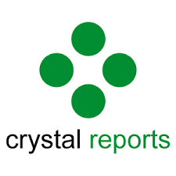
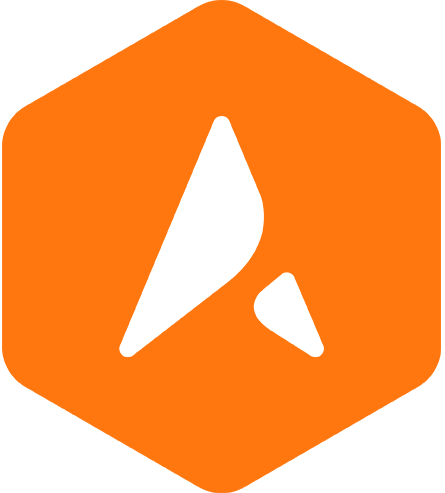

<h1 align="center">Md Tariq-ul Islam</h1>

Full-Stack Developer

 

I'm passionate to face challenges and build solutions for desktop and mobile platform.✨

 

## About me ⚓
Experience in implementing multiple business ideas in demanding, growing, rapidly changing circumstances. Familiar with working with a diverse population in a stressful, fast-paced environment. Adopt never give up attitude. 🚀

 

Here's a list of things I currently keep myself busy with:👏
- 🛠 Learning software development at [Microverse](https://www.microverse.org/?gclid=CjwKCAiAheacBhB8EiwAItVO257egk_saZ6PFckqnaXy0WbCa9AxUGdXwRfjNsJLvrjyxINbJWkEkBoCcqcQAvD_BwE).
- ♨ Learning how to build software using CSS, HTML, JavaScript, Ruby, and so on.
- 🌍 Learning how to work remotely and collaboratively around the world.
- 💻 Pair programs using Zoom meeting with software developers from all over the world.

 

<h2 align="left">Languages and Tools:🌳</h2>
 

  
  
  
  
  
  
  
  
  
  
  
  
  
  
  
  
  
  
  

 
 

<h2 align ="left">GitHub Stats</h2>
 

  
  

 
 

  <h2 align="center">☕ Social links ⛓</h2>
  
  
  

 
 
